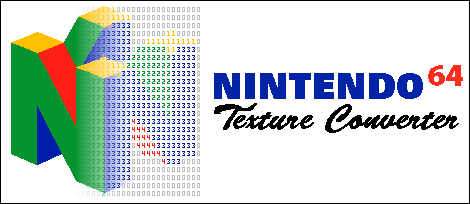

  

 

**The code in this repo might be unstable! For stable versions, as well as compiled binaries, head to the [releases page](https://github.com/buu342/GML-N64TextureConverter/releases)** 
The N64 Texture Converter is a GUI based tool that allows you to import a myriad of image formats (.bmp, .gif, .jpg, .png, .ico) and export them as a Nintendo 64 compatible C or binary file. Supports all known image formats used by libultra. 
Comes with a manual that teaches both how N64 compatible textures work, and how to use the tool itself. 
Created in GameMaker: Studio 1.4.  

### System Requirements
* Windows XP or later (Can be run on Linux through Wine)
* DirectX 9 compatible graphics card with at least 32MB of video memory
* DirectX 9 compatible sound card
* 128 MB of memory or greater
* 800×600 or greater screen resolution with 16-bit or 32-bit colors  

### Compiling Source Code

N64 Texture Converter

* Grab a registered copy of GameMaker: Studio 1.4, and start the program.
* In the `Open` tab, navigate to the `N64 Texture Converter.gmx` folder and load the `N64 Texture Converter.project.gmx` file.
* Once loaded, ensure that `Target` is set to Windows.
* Hit the Create Application Button.
* Export as either `Windows NSIS Installer (*.exe)` or as `Compressed Applications zip (*.zip)`. The program may not function correctly if `Single runtime executable (*.exe)` is used.

GMSFiles DLL

* Grab a registered copy of Microsoft Visual C++ 2008, and start the program.
* Load the `GMSFiles.vcproj` project file located in `GMSFiles Source`.
* Ensure that the solution configuration is set to `Release` and `Win32`.
* Build the solution.

HTML Help Document

* Grab a copy of HTML Help Workshop, and start the program.
* Load the `Help.hpp` project file located in `Help File Source`.
* Hit the compile button.

 

### Bugs
* None as far as I know  

### FAQ
**Q:** The program crashes when I launch it and/or I get "Failed to initialize drawing surfaces"! 
**A:** Either your computer isn't powerful enough to run the program, or you forgot to enable graphics passthrough on your Virtual Machine. Also, make sure DirectX 9 is installed.  

**Q:** Does this work in macOS and/or Ubuntu? 
**A:** Yes, this tool should work perfectly fine using [Wine](https://www.winehq.org/). While GameMaker: Studio lets me export stuff for Ubuntu and macOS (and I have the licenses for it), the actual process of getting binaries out is [ridiculously complex](https://help.yoyogames.com/hc/en-us/articles/216754458-Setup-Ubuntu-And-GameMaker-Studio-For-Linux-Development) that it's not worth the effort.  

**Q:** Why Game Maker? 
**A:** Because it's convenient. Why spend a few days learning 5 different APIs to be able to import different types of files, another for image editing, etc... when I have a program that lets me get something up and running (and that supports everything I need it to) in a few hours?  

**Q:** The older versions of this used to be a single executable. Why is this so bloated now? 
**A:** Long story short, it's a bug with how GameMaker: Studio handles filesystem stuff when all the data is packed into the .exe  

### Credits
The GMSFiles DLL, while written by me, is heavily based off the source code of the [GMFilesystem](https://code.google.com/archive/p/gm-filesystem/) extension created by paul23, the [Dialogue Module](https://samuel-venable.itch.io/gamemaker-extension-collection) and [Execute Shell](https://marketplace.yoyogames.com/assets/575/execute-shell) extensions created by Samuel Venable.
